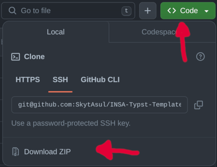
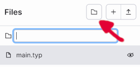

%5D.version&style=for-the-badge&label=Report%20Version&color=red)
%5D.version&style=for-the-badge&label=Letter%20Version&color=orange)

# INSA - Typst Template
Typst Template for documents from the french engineering school INSA.  
It was primarily made for INSA Rennes, but it should be easily modified to suit other INSA schools.

# Examples
You can find examples for the 3 document types [in the `exemples` folder](exemples).

# Usage
## From online package
Templates are available in the official Typst templates repository (Typst Universe):
- `insa-report` and `insa-document` are under the name [`silky-report-insa`](https://typst.app/universe/template/silky-report-insa)
- `insa-letter` is under the name [`silky-letter-insa`](https://typst.app/universe/template/silky-letter-insa)

There are multiple ways to use them:
- From the [Typst web application](https://typst.app/), click on the "Start from template" button and search for the template you want in the list. Click on it, select a name, and click on "Create". Voilà!
- If you want to initialize a new project through the CLI, use
    ```sh
    $ typst init @preview/<template-name>:<version>
    ```
- If you want to add it to an existing project, copy the `#show` rule from an example [in the `exemples` folder](exemples) *but* replace the `import` by this line:
    ```typst
    #import "@preview/<template-name>:<version>": *
    ```
> [!IMPORTANT]  
> (replace `<template-name>` by the one you need and `<version>` by the latest version available, see at the top)

## From sources (editable version)
1. Download the code from GitHub. To do that, click on the green "Code" button and then "Download ZIP".  
    
1. Open the ZIP archive file and copy the `insa-template` folder in the directory with your Typst project.
1. (*OPTIONAL*) If you are using the Typst web application, you have to first *create* the `insa-template` folder by clicking on the little folder button in the "Files" panel.  
    
1. (*OPTIONAL*) After creating the folder, simply drag all the files you downloaded in it (`template.typ, cover.jpg, footer.png, logo.png`).
1. Choose between the 3 available templates: `insa-document`, `insa-report` or `insa-letter`.
1. Add this line at the beginning of your Typst file (by default, `main.typ`):
    ```typst
    #import "insa-template/letter-template.typ" : * // for letters and short documents
    #import "insa-template/document-template.typ" : * // for reports and full documents
    ```
1. Copy the `#show` rule from the example document of the template you chose to your Typst file. In example:
    ```typst
    #show: doc => insa-letter(
      author: [
        Youenn LE JEUNE\
        3 INFO G2.1
      ],
      doc
    )
    ````
1. Enjoy!

# Fonts (polices)
The graphic charter recommends the fonts **League Spartan** for headings and **Source Serif** for regular text. To have the best look, you should install those fonts.

To behave correctly on computers without those specific fonts installed, this template will automatically fallback to other similar fonts:
- **League Spartan** -> **Arial** (approved by INSA's graphic charter, by default in Windows) -> **Liberation Sans** (by default in most Linux)
- **Source Serif** -> **Source Serif 4** (downloadable for free) -> **Georgia** (approved by the graphic charter) -> **Linux Libertine** (default Typst font)

## Note on variable fonts
If you want to install those fonts on your computer, Typst might not recognize them if you install their _Variable_ versions. You should install the static versions (**League Spartan Bold** and most versions of **Source Serif**).

Keep an eye on [the issue in Typst bug tracker](https://github.com/typst/typst/issues/185) to see when variable fonts will be used!

# Platforms
The template can be used in the web Typst editor *and* in a local environment.

I personnally prefer to use it in Visual Studio Code with the `Typst LSP` And `Typst Preview` extensions.

You can also directly edit your Typst files with a simple text editor and compile it with the Typst CLI.
See [Installation](https://github.com/typst/typst?tab=readme-ov-file#installation) and [Usage](https://github.com/typst/typst?tab=readme-ov-file#usage) sections on the official Typst repository.

# License
The typst templates (`.typ` files) are licensed under MIT. This does _not_ apply to the assets under `/insa-template/assets`. Those image files are property of Groupe INSA and INSA Rennes.